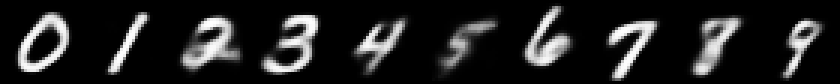

# VAE

A minimal PyTorch implementation of a Variational Autoencoder (VAE), trained on MNIST to learn a compressed latent representation of handwritten digits and generate new digit images from it.

## Files

- `model.py` — defines the `VariationalAutoEncoder` class: a fully-connected encoder that maps an input image to a mean/sigma pair in latent space, and a decoder that reconstructs an image from a sampled latent vector (using the reparameterization trick).
- `train.py` — downloads MNIST, trains the VAE (reconstruction loss + KL divergence), and then runs inference to generate sample images for each digit 0-9.

## Model

- Input: flattened 28x28 MNIST images (784 dimensions)
- Hidden layer size: 200
- Latent dimension: 20
- Loss: binary cross-entropy reconstruction loss + KL divergence between the learned latent distribution and a standard normal

## Requirements

- Python 3.8+
- torch
- torchvision
- tqdm
- numpy<2 (some torch builds are compiled against NumPy 1.x and crash under NumPy 2.x — `pip install "numpy<2"` if you hit `RuntimeError: Numpy is not available`)

Install with:

```bash
pip install -r requirements.txt
```

## Usage

Train the model and generate sample images:

```bash
python train.py
```

This will download MNIST into `dataset/` on first run, train for 10 epochs, and then save generated images as `generated_{digit}_ex{n}.png` for each digit, produced by sampling new latent vectors around that digit's learned encoding.

You can also run `model.py` directly to sanity-check the model's output shapes on random input:

```bash
python model.py
```

## Results

One sampled generation per digit (0–9) after a full 10-epoch training run:



The latent space is smooth enough that sampling around each digit's learned encoding reliably decodes back into a legible, correctly-shaped digit.
